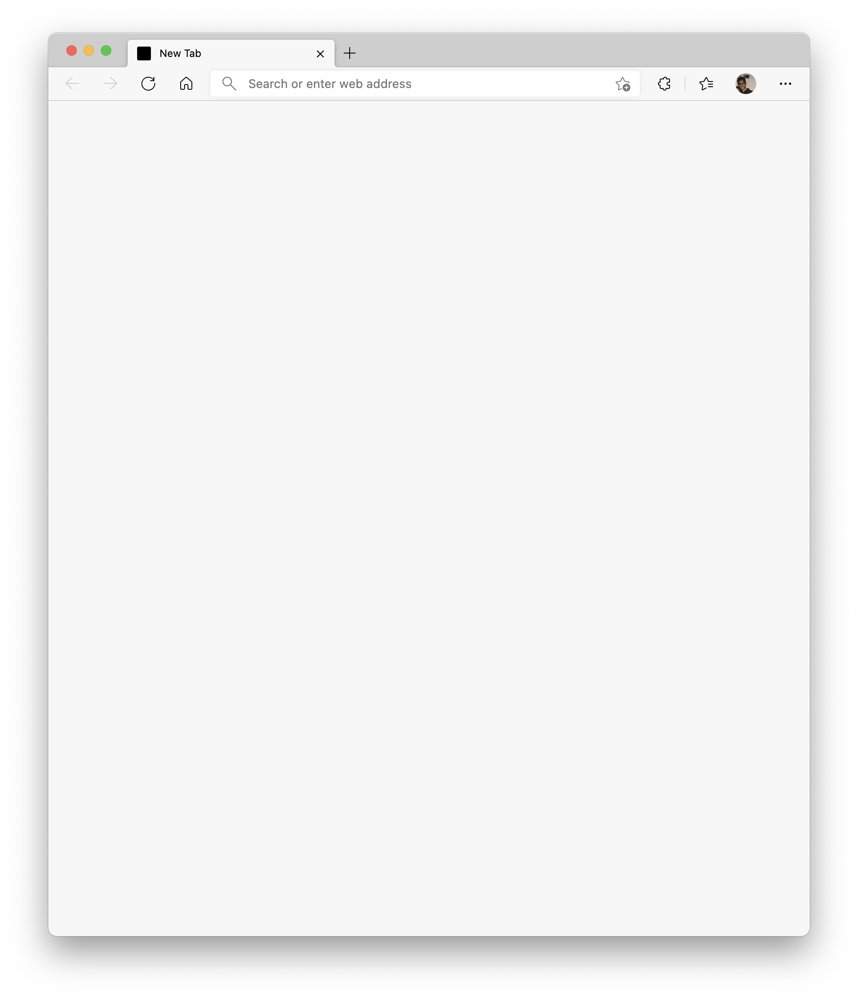
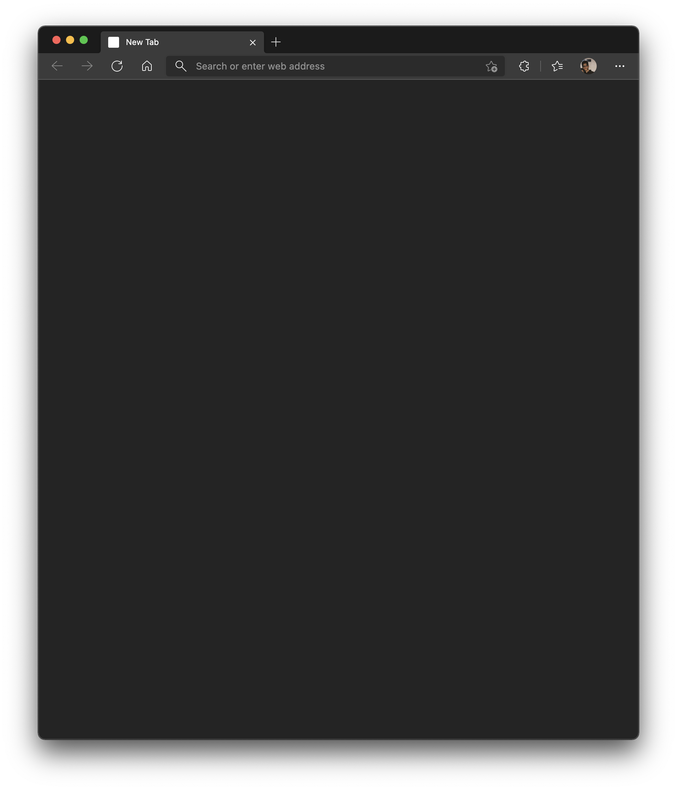

# blank-new-tab-page
> Use a blank page with auto light/dark mode as your browser's new tab page.

## Instructions
1. Open [chrome://extensions](chrome://extensions) or [edge://extensions](edge://extensions)
1. Enable "Developer Mode"
1. Click "Load Unpacked"
1. Select the `Blank New Tab Page` extension folder from this repo

## Preview
| Light Mode | Dark Mode |
| ---------- | --------- |
|  |  |